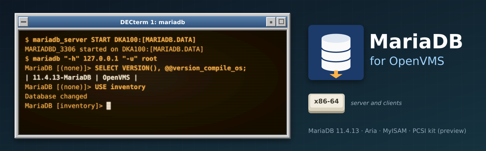

<p align="center">
  
</p>

# MariaDB for OpenVMS

[](https://github.com/issinoho/vms-mariadb/releases/latest)
[](https://github.com/issinoho/vms-mariadb/releases)

[](COPYING)

[MariaDB](https://mariadb.org) (**11.4.13**, the 11.4 LTS series) built natively for OpenVMS
**x86-64**, server and command-line clients, with VSI's clang-based C/C++ compiler. This is a
**preview**: the server runs the Aria, MyISAM, MEMORY, CSV, MRG_MyISAM and SEQUENCE engines,
but not yet InnoDB. It belongs to the same family as
[GNU grep](https://github.com/issinoho/vms-grep), [curl](https://github.com/issinoho/vms-curl),
[GNU sed](https://github.com/issinoho/vms-sed), [GNU awk](https://github.com/issinoho/vms-awk),
[GNU make](https://github.com/issinoho/vms-make),
[GNU diffutils](https://github.com/issinoho/vms-diffutils),
[GNU patch](https://github.com/issinoho/vms-patch), [GNU m4](https://github.com/issinoho/vms-m4),
[GNU Bison](https://github.com/issinoho/vms-bison), [flex](https://github.com/issinoho/vms-flex),
[GNU Wget](https://github.com/issinoho/vms-wget), [PCRE2](https://github.com/issinoho/vms-pcre2),
[zlib](https://github.com/issinoho/vms-zlib), [bzip2](https://github.com/issinoho/vms-bzip2),
[XZ Utils](https://github.com/issinoho/vms-xz) and [Zstandard](https://github.com/issinoho/vms-zstd)
for OpenVMS.

MariaDB has no OpenVMS build of its own. This repository holds **only our changes**: every
build starts from MariaDB's signed release tarball (key pinned in `keys/`), applies the
patches in `patches/`, adds our files from `overlay/`, configures with CMake on a Linux host
(check results replayed on the VMS node) and builds with MMS on the node.

- **Compiler:** VSI C++ 10.1 (clang 10, LP64) for all of MariaDB, C and C++.
- **TLS:** VSI's OpenSSL 3.0 kit (SSL3), linked through its shared images.
- **PCRE2:** a clang build of [vms-pcre2](https://github.com/issinoho/vms-pcre2), linked in;
  zlib is MariaDB's bundled copy.
- **VMS behaviour:** C RTL features are set inside every image (`LIB$INITIALIZE`); a shared
  descriptor layer in mysys makes file I/O coherent across descriptors; `thread_local` is
  replaced by pthread keys.

## Status

| Stage | Deliverable | Status |
|---|---|---|
| A | Connector/C and the clients | done: 15/15 client tests against MariaDB 11.8, TLS 1.3, interactive use |
| B | `mariadbd` with Aria, MyISAM, MEMORY, CSV, MRG_MyISAM, SEQUENCE | server tests 14/14; 1,000,000-row (150 MB) loads and 5/5 stop/start cycles with identical checksums; remote clients from Linux over TLS; a 24-hour soak still to run |
| C | InnoDB, durability-tested | not started |
| D | PCSI kit, docs, upstream patches | preview kit ([v11.4.13-vms3](https://github.com/issinoho/vms-mariadb/releases/tag/v11.4.13-vms3)) builds; vms2 passed the full install check, including the server as a service; vms3 was tested as an upgrade of a running service (vms2 to vms3) |

| | x86-64 (OpenVMS E9.2-4, VSI C++ 10.1) |
|---|---|
| Server and clients build (MMS from CMake's file API) | yes (600 server objects) |
| Client suite over TCP and TLS, against a remote server and against the VMS server | 15/15 |
| Server tests: engines, joins, CHECK/REPAIR/OPTIMIZE, restart, DROP DATABASE | 14/14 |
| Load and restart: 1M rows into Aria and MyISAM, 5 clean stop/start cycles | pass |
| Kit install, INSTALL_DB, START, clients from the kit, STOP, remove | clean |
| Service: configure (account, data, passwords), boot start as the account, clean shutdown | pass |
| PCSI kit | `ISSINOHO-X86VMS-VMSMARIADB-V1104-13E3-1.PCSI` |

IA64 is not a target: its C++ compiler (VSI C++ 7.4) predates C++11, which MariaDB requires.

## Installing the kit

The kit needs OpenVMS x86-64 and VSI's **SSL3** kit (OpenSSL 3.0). Download it from the
[release](https://github.com/issinoho/vms-mariadb/releases/tag/v11.4.13-vms3) and check it
against the release's `SHA256SUMS`. A kit downloaded through a non-VMS system loses its
record format, so restore that first, then install it:

```
$ SET FILE/ATTRIBUTE=(RFM:FIX,LRL:8192,MRS:8192,RAT:NONE) ISSINOHO-X86VMS-VMSMARIADB-V1104-13E3-1.PCSI
$ PRODUCT INSTALL VMSMARIADB /PRODUCER=ISSINOHO /SOURCE=dev:[dir]
$ @VMSMARIADB$ROOT:[000000]VMSMARIADB$SETUP.COM
```

The kit is not signed, so PCSI notes that it cannot validate a signature. It installs:

```
VMSMARIADB$ROOT:[BIN]MARIADBD.EXE        (the server)
VMSMARIADB$ROOT:[BIN]MARIADB.EXE, MARIADB-ADMIN, -CHECK, -DUMP, -IMPORT, -SHOW, -SLAP,
                     MY_PRINT_DEFAULTS, PERROR
VMSMARIADB$ROOT:[SHARE...]               error messages (28 languages), character sets
VMSMARIADB$ROOT:[SCRIPTS]                the SQL that creates the system tables
VMSMARIADB$ROOT:[000000]VMSMARIADB$SETUP.COM    (defines the client commands)
VMSMARIADB$ROOT:[000000]VMSMARIADB$SERVER.COM   (INSTALL_DB, START, STOP, STATUS)
VMSMARIADB$ROOT:[000000]VMSMARIADB$CONFIGURE.COM  (sets the server up as a service)
VMSMARIADB$ROOT:[DOC]README.VMS, COPYING., CREDITS.
SYS$STARTUP:VMSMARIADB$STARTUP.COM, VMSMARIADB$SHUTDOWN.COM
```

It defines the rooted logical name `VMSMARIADB$ROOT` and prints the post-installation tasks.
For a server started at boot, run `VMSMARIADB$CONFIGURE.COM` once ([Running as a
service](#running-as-a-service)); otherwise, to define `VMSMARIADB$ROOT` at every boot, add
`$ @SYS$STARTUP:VMSMARIADB$STARTUP.COM` to `SYS$MANAGER:SYSTARTUP_VMS.COM`.
`PRODUCT REMOVE VMSMARIADB` removes the product and deassigns `VMSMARIADB$ROOT`; it does not
touch data directories, the service account or the site file
`SYS$MANAGER:VMSMARIADB$CONFIG.COM`. The version `V11.4-13E3` is MariaDB 11.4.13 with our
patch level as the ECO.

**Alongside VSI's MariaDB kit:** this kit uses `VMSMARIADB` names throughout, so both can be
installed.

## Running a server

```
$ mariadb_server INSTALL_DB DKA100:[MARIADB.DATA]
$ mariadb_server START DKA100:[MARIADB.DATA]
$ mariadb "-h" 127.0.0.1 "-u" root
MariaDB [(none)]> ALTER USER root@localhost IDENTIFIED BY 'secret';
$ mariadb_server STOP 3306 "--password=secret"
```

(`mariadb_server` is `@VMSMARIADB$ROOT:[000000]VMSMARIADB$SERVER.COM`.)

- **INSTALL_DB** creates the data directory, and `<name>_TMP` beside it for temporary files,
  both with `/VERSION_LIMIT=1` (MariaDB replaces files by truncation and rename, which on
  VMS would leave old versions), and creates the system tables. The data directory must be on
  an **ODS-5** disk. The root accounts have no password: set one at once.
- **START** runs `mariadbd` as a detached process `MARIADBD_<port>` (default port 3306) under
  the starting account's UAF quotas. Its error log is `<datadir>mariadbd.err`. If
  `<datadir>MY.CNF` exists it is the server's only option file; otherwise the server runs
  with `--no-defaults`. A fourth parameter passes one more option, such as
  `"--bind-address=127.0.0.1"`.
- **STOP** asks the server to shut down (`mariadb-admin shutdown` as root); **STATUS** reports
  on it. Both take an option file (`"--defaults-file=..."`) instead of root's password. Stop
  the server this way, not with `STOP/ID`.
- **Quotas:** a server with the default buffers uses about 500 MB of virtual memory, so the
  account needs a matching `PGFLQUOTA`; give it `FILLM` 150 or more (1000 for many
  tables). START sizes `table_open_cache` from the process's `FILLM`, `(FILLM - 50) / 4`,
  unless `MY.CNF` sets it: past `FILLM`, tables fail to open.

## Running as a service

`VMSMARIADB$CONFIGURE.COM`, run once by SYSTEM, sets the server up to run under its own
account, start at boot and stop cleanly at shutdown:

```
$ @VMSMARIADB$ROOT:[000000]VMSMARIADB$CONFIGURE
```

It asks for the data directory (ODS-5, two levels deep, e.g. `DKA100:[MARIADB.DATA]`; the
parent is the account's login directory), the port, the account (`MARIADB`, UIC `[360,1]` or
the next free group) and the password for MariaDB's root accounts, shows the AUTHORIZE
commands, and asks before changing anything. Then it:

- adds the account: batch access only, `/FLAGS=(NODISUSER,DISMAIL,DISNEWMAIL)`, privileges
  `TMPMBX` and `NETMBX`, `PGFLQUOTA` 8,000,000, `FILLM` 1000; an existing account is used as
  it is (it must have BATCH access and NODISUSER, and must not be RESTRICTED);
- creates the data directory and sets root's password, or keeps an existing data directory
  (stop its server first);
- creates `vmsmariadb_shutdown`, with only the SHUTDOWN privilege and a random password kept
  in `<datadir>VMSMARIADB$SHUTDOWN.CNF`, so no root password sits in a startup file;
- gives the data directory to the account and writes `SYS$MANAGER:VMSMARIADB$CONFIG.COM`
  (data directory, port, account, node, autostart), which upgrades leave alone.

Then add to `SYS$MANAGER:SYSTARTUP_VMS.COM`, after TCP/IP and the batch queues have started,
and to `SYS$MANAGER:SYSHUTDWN.COM`:

```
$ @SYS$STARTUP:VMSMARIADB$STARTUP.COM START
$ @SYS$STARTUP:VMSMARIADB$SHUTDOWN.COM
```

`STARTUP START` submits a batch job as the account (`SUBMIT/USER`), so the server has the
account's username, UAF quotas and privileges; it does nothing if autostart is off, the site
file names another node, or `MARIADBD_<port>` already runs. `SHUTDOWN` stops the server
through the shutdown account and waits for it to exit. Run the same two procedures by hand to
stop and start the service. Stop it before installing a newer kit or removing this one. To
remove the service, take out the two lines, delete the site file and remove the account.
Details in `README.VMS` and [docs/PLAN_SERVICE.md](docs/PLAN_SERVICE.md).

## Using the clients

`VMSMARIADB$SETUP.COM` defines `mariadb`, `mariadb_admin`, `mariadb_check`, `mariadb_dump`,
`mariadb_import`, `mariadb_show`, `mariadb_slap`, `my_print_defaults`, `perror` and
`mariadb_server` (DCL symbols cannot contain `-`). Options are case-sensitive (`-P` is the
port, `-p` the password): quote them, or `SET PROCESS/PARSE_STYLE=EXTENDED` first; batch
jobs use the TRADITIONAL style.

```
$ mariadb "-h" dbhost "-u" me "-p" mydb
$ mariadb_dump "--host=dbhost" "--user=me" "-p" "--result-file=mydb.sql" mydb
```

DCL has no `>` redirection and the clients do not do their own: `> mydb.sql` reaches the
program as two more arguments (mariadb-dump: `Couldn't find table: ">"`). Write to a file
with `--result-file`, or `DEFINE/USER SYS$OUTPUT mydb.sql` before the command.

Connections are TCP only: give `-h` (`127.0.0.1` for a local server), since `localhost`
means a Unix-domain socket, which VMS lacks. TLS works, through the SSL3 kit.

## Limitations of this preview

- No InnoDB (and so no transactions), Performance Schema, replication testing, or plugins
  loaded at run time. MyISAM is the default engine.
- TCP only; no `unix_socket` authentication.
- **Uncached reads are slow.** The C RTL issues an extra disk I/O for every `read()`, so a
  full scan of a MyISAM table with dynamic rows (`CHECKSUM TABLE`, `CHECK TABLE`) runs at a
  few hundred kilobytes per second. A block layer in mysys is planned.
- One statement that uses more tables than `FILLM` allows fails (each open table holds up to
  four channels): raise `FILLM`.
- No rotation of `mariadbd.err`.
- A 24-hour soak test has not been run yet.

## Common problems

Problems users have reported, and what to do. Each has an entry in
[docs/PORTING_LOG.md](docs/PORTING_LOG.md) with the root cause.

**Using the kit**

| Symptom | Cause and fix |
|---|---|
| `Can't connect to server on '<host>' (36)` | Kits before V11.4-13E3: 36 (`EINPROGRESS`) hid the real error (patch 0028). Upgrade; the error is then `(61)` or `(60)`. |
| `Can't connect to server on '<host>' (61)` | Connection refused: nothing listens on that address and port. Check the server is running, its `port` and `bind-address`, and `-P` (upper case, quoted). |
| `Can't connect to server on '<host>' (60)` | Timed out: the host is unreachable or a firewall drops the connection. `perror 60` explains any such number. |
| `Couldn't find table: ">"` (mariadb_dump) | DCL has no `>` redirection: use `"--result-file=file"` or `DEFINE/USER SYS$OUTPUT file` (see [Using the clients](#using-the-clients)). |
| An option seems ignored, or `-P` asks for a password | DCL lowercased an unquoted option (`-P` became `-p`): quote options, or `SET PROCESS/PARSE_STYLE=EXTENDED`. |
| `ERROR 24 ... Can't read value for symlink './<db>'` on `DROP DATABASE` | Kits before V11.4-13E3 (patch 0027): the tables are dropped but the directory stays. Upgrade, then drop it again. |
| Configure asks for root's password again with no reason given | Kits before V11.4-13E3: the two passwords were empty or different, and on a terminal the next prompt overwrote the message saying so. Type the same password twice. |
| `ERROR 1146 ... doesn't exist` for a table `SHOW TABLES` lists, after many tables were opened | The server's account ran out of `FILLM` (every open table holds channels): raise `FILLM` to 1000 or more, or lower `table_open_cache`. |

**Building from source**

| Symptom | Cause and fix |
|---|---|
| `build.sh: the server needs PCRE2`, `BUILD: no PCRE2$ROOT:[INCLUDE]PCRE2.H`, or `'pcre2.h' file not found` | The server build needs vms-pcre2's clang install tree as the 8th column of `tools/nodes.conf` (see [How to build](#how-to-build)). |
| `BUILD: PCRE2$ROOT:[LIB]PCRE2-8.OLB was not built by clang` | The 8th column names vms-pcre2's VSI C tree (`INSTALL_X86_64`); use `INSTALL_X86_64_CLANG` (`@[.VMS]BUILD ALL "" CLANG` in vms-pcre2). |
| `BUILD: compiler self-check failed` | Before each build, `vms/tests/calloc_shape_test.c` is compiled with the build's flags; VSI clang's memset/bzero lowering returned the wrong pointer. Check that `overlay/vms/config/clang_common.rsp` still has `-fno-builtin-memset -fno-builtin-bzero`, or the compiler changed. |
| `warning: 'format' attribute argument not supported: vms_lp64_printf [-Wignored-attributes]`, on most files | A tree prepared before patch 0029: harmless (format checking was off). `git pull`, `tools/prepare.sh`, then build from `CLEAN`. `BUILD: format-attribute check failed` means the patch is missing from the tree. |
| You edited `DESCRIP.MMS` to add `-I PCRE2$ROOT:[...INCLUDE]` | Don't: it already has `-I/PCRE2$ROOT/INCLUDE`, with `PCRE2$ROOT` defined by `BUILD.COM` from its 4th parameter, the rooted clang tree (`dev:[dir.INSTALL_X86_64_CLANG.]`). Run the build through `@[.VMS]BUILD`, not `MMS` directly: it makes that definition and runs the checks above. |
| The linker options name `PCRE2$ROOT:[LIB]PCRE2-8.OLB`, with no `[INSTALL_X86_64...]` directory, and `pcre2.h` is not found | `PCRE2$ROOT` is the install tree itself, a rooted logical (`dev:[dir.INSTALL_X86_64_CLANG.]`), not the top of vms-pcre2; `BUILD.COM` defines it from P4, so pass P4 when you rerun it by hand. Don't change the `.opt` files or `server.link` to `[INSTALL_X86_64.LIB]`: that is the VSI C (ILP32) library, which links but fails at run time, and the clang check sees only `PCRE2$ROOT:[LIB]`. `BUILD.COM` now stops on such an edit (`BUILD: the options files above must name PCRE2 only as ...`); `SEARCH [.VMS.BUILD.SERVER]*.OPT PCRE2` should show only `PCRE2$ROOT:[LIB]PCRE2-8.OLB/library`. |
| `sed: 1: "d}": extra characters at the end of d command` (macOS) | An older checkout: `git pull`, then `tools/prepare.sh`. |
| `'probes_mysql_dtrace.h' file not found` (macOS host) | An older checkout enabled DTrace because the host has `dtrace`: `git pull`, then `tools/prepare.sh`. |
| `needs bash 4 or later` or `not found on this host: ...` | The host scripts check for these first: install the tools named (on macOS, `brew install bash` with Homebrew's `bin` first in `PATH`). |
| `kit: client build failed` | The build's own output is in `out/kit-build-<node>-<config>.txt`. |
| A fix in a header, or a new clang flag, makes no difference | MMS tracks neither headers nor flags: `tools/build.sh <node> <config> CLEAN`, then build again. |

## Patches

| Patch | Purpose |
|---|---|
| 0001 | `cmake`: no readline or curses on OpenVMS. |
| 0002 | `include/my_time.h`: no `suseconds_t`. |
| 0003 | `mysys/my_lib.c`: define `_POSIX_PATH_MAX` where `<limits.h>` does not. |
| 0004 | `mysys/guess_malloc_library.c`: needs `RTLD_DEFAULT`, not just `dlopen()`. |
| 0005 | `include/my_global.h`: `<stdint.h>` for `intptr_t`. |
| 0006 | `my_global.h`, `ma_global.h`: include `<pwd.h>` first (its macros clash otherwise). |
| 0007, 0010 | Connector/C, `my_net.h`: no `<netinet/in_systm.h>` or `<netinet/ip.h>`. |
| 0008 | mysys: portable CRC-32/CRC-32C on x86-64 (no SIMD paths yet). |
| 0009 | `client/mysql.cc`: read input lines without readline. |
| 0011, 0012 | Connector/C, mysys: read passwords without echo (`$QIO`). |
| 0013 | `my_global.h`: failing programs exit with error severity. |
| 0014 | mysys: one shared descriptor per file (`my_vmsfile.c`): the C RTL buffers per descriptor, so writes through one are not seen through another. |
| 0015, 0016 | stack traces: no `addr2line` resolver; `my_write_core()` uses `raise()`. |
| 0017 | `myrg_static.c`: always include `myrg_def.h`. |
| 0018, 0019 | tpool, sql: `thread_local` through pthread keys (VSI C++ has no `thread_local`). |
| 0020 | `my_pthread.h`: `pthread_sigmask()` through `sigprocmask()`. |
| 0021 | `mysqld.cc`: `--chroot` is an error. |
| 0022 | sql: cast `my_time_t` to `time_t` in brace initialisers (32-bit `time_t`). |
| 0023 | `my_lock.c`: `fcntl()` locks through the shared descriptor. |
| 0024 | Aria: no directory descriptor. |
| 0025 | `mysqld.cc`: a socket pair, not a pipe, wakes the listen loop (`poll()` reports a pipe readable early). |
| 0026 | clients: `main()`'s status through `exit()`, so a failing mariadb-admin, -dump, -check, -import or my_print_defaults gives DCL an error status. |
| 0027 | `my_readlink()`: a directory is not a symlink (VMS `readlink()` gives `ENOENT` for it, not `EINVAL`), so `DROP DATABASE` removes the directory. |
| 0028 | Connector/C: a failed connect reports its real error (`ETIMEDOUT`, `ECONNREFUSED`), not the stale `EINPROGRESS` (36) left by the non-blocking `connect()`. |
| 0029 | `my_attribute.h`: `ATTRIBUTE_FORMAT(printf, ...)` reaches clang as `format(__printf__, ...)`, not `format(vms_lp64_printf, ...)` (vms_lp64.h's `printf` macro), so printf formats are checked. |

Each patch is guarded by `__VMS` and carries its reason; [docs/PORTING_LOG.md](docs/PORTING_LOG.md)
records every failure and fix, and [docs/DECISIONS.md](docs/DECISIONS.md) every design
choice and the alternatives considered.

## How to build

The build runs from a Linux or macOS host (macOS is not tested here, but a user's build from
macOS 26 got to the node) with bash 4 or later (macOS's `/bin/bash` is 3.2: use Homebrew's;
the scripts check) that has CMake, a native C/C++ toolchain (for MariaDB's
generators) and ssh/sftp access to an OpenVMS x86-64 node with VSI C++ 10.1, MMS, the SSL3
kit and a clang build of [vms-pcre2](https://github.com/issinoho/vms-pcre2) (`PCRE2$ROOT`,
the 8th column of `tools/nodes.conf`). Work directories must be on ODS-5 volumes.

```sh
git clone https://github.com/issinoho/vms-mariadb.git
cd vms-mariadb
tools/sysroot.sh x86             # once: VSI SSL3 and PCRE2 headers for the host CMake
tools/prepare.sh                 # fetch + verify the release, apply patches, add overlay/, CMake, MMS
JOBS=2 tools/build.sh x86 client # push, then @[.VMS]BUILD CLIENT on the node
JOBS=2 tools/build.sh x86 server
tools/kit.sh x86                 # PCSI kit -> out/kits/
```

`tools/replay.sh` answers new CMake checks on the node, `tools/servertest.sh` and
`tools/clienttest.sh` run the tests. `tools/installcheck.sh` installs the kit, runs a server
from it, then configures the service with a **temporary account** (`MDBSVCT [361,1]`, port
3309), starts and stops it, and removes the account and the kit: it changes the system's UAF
and PCSI database while it runs (`SVC=0` skips the service part).
Set up `tools/nodes.conf` as described in
[vms-grep's README](https://github.com/issinoho/vms-grep#2b-build-on-vms-from-the-host-over-ssh),
with an 8th column for the server: vms-pcre2's clang install tree as a rooted directory, e.g.
`DKA0:[USERS.ME.PCRE2-10_49.INSTALL_X86_64_CLANG.]` (built there with `@[.VMS]BUILD ALL "" CLANG`);
the server build refuses a PCRE2 library not compiled by clang. Before MMS runs, `BUILD.COM`
also compiles and runs a compiler self-check with the build's flags and checks that
printf-format attributes survive `vms_lp64.h` (see [Common problems](#common-problems)).

**Building on the node, in batch.** `build.sh` pushes the tree and runs `BUILD.COM` over ssh,
waiting for the whole build. On the node, after `prepare.sh` and a push (`tools/push.sh x86
server`, or copy `staging/mariadb-11.4.13` across), the same build can run as a batch job,
with its log in one file:

```
$ SUBMIT/NOPRINT/NAME=MDBBUILD/LOG_FILE=dev:[dir]MDBBUILD.LOG -
    /PARAMETERS=(SERVER,ALL,"","dev:[dir.PCRE2-10_49.INSTALL_X86_64_CLANG.]") -
    dev:[dir.MARIADB-11_4_13.VMS]BUILD.COM
```

P1 is the configuration (`CLIENT` or `SERVER`), P2 the MMS target (`ALL`, `CLEAN`, or a
`LIB_` name from `vms/build/<config>/TARGETS.TXT`), P3 `KEEP_GOING` or `""`, P4 the PCRE2
tree (server only). `BUILD.COM` sets its own default directory, logicals and process
settings, so it needs nothing from your login; the log ends in `BUILD: done` on success. A
server build from `CLEAN` takes some hours. Run one build job at a time: the self-checks
write their output to fixed names in `SYS$SCRATCH`.
The original plan is in [MARIADB_OPENVMS_PLAN.md](MARIADB_OPENVMS_PLAN.md).

```
upstream.conf      release, tarball URL, SHA-256, signing key fingerprint
keys/              MariaDB's release signing key
patches/           changes to upstream files (quilt-style series)
overlay/           new files only (VMS build, kit, mysys file layer, tests)
probes/            small C/C++ programs that answer platform questions on the nodes
tools/             host-side scripts
docs/              decisions, porting log, environment and probe results
```

## Roadmap

1. The 24-hour soak, closing Stage B.
2. Faster file I/O: block reads and writes in the mysys file layer.
3. InnoDB (Stage C), durability-tested.
4. Option files and default paths under `VMSMARIADB$ROOT`.
5. The portable patches offered to MariaDB.

The family of ports, each following its upstream releases:

| Port | Latest release | |
|---|---|---|
| GNU grep — [vms-grep](https://github.com/issinoho/vms-grep) | [v3.12-vms3](https://github.com/issinoho/vms-grep/releases/tag/v3.12-vms3) | with `grep -P` through PCRE2 |
| PCRE2 — [vms-pcre2](https://github.com/issinoho/vms-pcre2) | [v10.49-vms1](https://github.com/issinoho/vms-pcre2/releases/tag/v10.49-vms1) | the regular-expression library |
| GNU sed — [vms-sed](https://github.com/issinoho/vms-sed) | [v4.10-vms1](https://github.com/issinoho/vms-sed/releases/tag/v4.10-vms1) | the stream editor |
| GNU awk (gawk) — [vms-awk](https://github.com/issinoho/vms-awk) | [v5.4.1-vms1](https://github.com/issinoho/vms-awk/releases/tag/v5.4.1-vms1) | built with gawk's own VMS port |
| zlib — [vms-zlib](https://github.com/issinoho/vms-zlib) | [v1.3.2-vms1](https://github.com/issinoho/vms-zlib/releases/tag/v1.3.2-vms1) | the compression library |
| bzip2 — [vms-bzip2](https://github.com/issinoho/vms-bzip2) | [v1.0.8-vms1](https://github.com/issinoho/vms-bzip2/releases/tag/v1.0.8-vms1) | the bzip2 compressor and libbz2 |
| XZ Utils — [vms-xz](https://github.com/issinoho/vms-xz) | [v5.8.4-vms1](https://github.com/issinoho/vms-xz/releases/tag/v5.8.4-vms1) | xz and liblzma |
| Zstandard — [vms-zstd](https://github.com/issinoho/vms-zstd) | [v1.5.7-vms1](https://github.com/issinoho/vms-zstd/releases/tag/v1.5.7-vms1) | zstd and libzstd |
| curl — [vms-curl](https://github.com/issinoho/vms-curl) | [v8.22.0-vms2](https://github.com/issinoho/vms-curl/releases/tag/v8.22.0-vms2) | alongside VSI's curl kit, following curl's own releases |
| GNU Wget — [vms-wget](https://github.com/issinoho/vms-wget) | [v1.25.0-vms2](https://github.com/issinoho/vms-wget/releases/tag/v1.25.0-vms2) | the web retriever |
| GNU m4 — [vms-m4](https://github.com/issinoho/vms-m4) | [v1.4.21-vms1](https://github.com/issinoho/vms-m4/releases/tag/v1.4.21-vms1) | the macro processor |
| GNU Bison — [vms-bison](https://github.com/issinoho/vms-bison) | [v3.8.2-vms2](https://github.com/issinoho/vms-bison/releases/tag/v3.8.2-vms2) | the parser generator; runs GNU m4 |
| flex — [vms-flex](https://github.com/issinoho/vms-flex) | [v2.6.4-vms1](https://github.com/issinoho/vms-flex/releases/tag/v2.6.4-vms1) | the scanner generator; runs GNU m4 |
| GNU make — [vms-make](https://github.com/issinoho/vms-make) | [v4.4.1-vms1](https://github.com/issinoho/vms-make/releases/tag/v4.4.1-vms1) | built with make's own VMS port |
| GNU diffutils — [vms-diffutils](https://github.com/issinoho/vms-diffutils) | [v3.12-vms1](https://github.com/issinoho/vms-diffutils/releases/tag/v3.12-vms1) | cmp, diff, diff3, sdiff |
| GNU patch — [vms-patch](https://github.com/issinoho/vms-patch) | [v2.8-vms1](https://github.com/issinoho/vms-patch/releases/tag/v2.8-vms1) | applies diffs |
| **MariaDB** (this port) — [vms-mariadb](https://github.com/issinoho/vms-mariadb) | [v11.4.13-vms3](https://github.com/issinoho/vms-mariadb/releases/tag/v11.4.13-vms3) | server and clients, x86-64; preview |

## Artwork

`docs/images/banner.svg` and `docs/images/icon.svg` were made for this project in the style
of classic DECwindows and VT terminals, like those of its sibling ports. The database mark in
them is our own drawing, not MariaDB's logo.

## Licence

MariaDB Server is distributed under the GNU General Public License, version 2 (`COPYING`,
a copy of the release tarball's, and `[VMSMARIADB.DOC]COPYING.` in the kit); Connector/C
under the LGPL 2.1 (`libmariadb/COPYING.LIB` in the tarball). Our patches and VMS files are distributed under the same terms as the files they
change or accompany. The kit is built from the signed MariaDB 11.4.13 release tarball and
the patches and files in this repository, which together are its corresponding source.

MariaDB is a trademark of the MariaDB Foundation. OpenVMS is a trademark of VMS Software,
Inc. This project is not affiliated with VMS Software, Inc., MariaDB plc or the MariaDB
Foundation.
